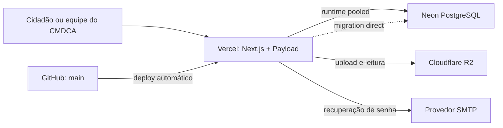

# Arquitetura

## Visão geral

## Responsabilidade de cada serviço

| Serviço | Mantém | Não mantém |
| --- | --- | --- |
| GitHub | código, migrações e documentação | segredos, dados do CMS e uploads |
| Vercel | builds, deployments, funções, logs e domínio | banco durável e arquivos enviados |
| Neon | conteúdo, usuários, versões e metadados do CMS | arquivos binários do R2 |
| Cloudflare R2 | imagens e PDFs | registros editoriais e permissões do CMS |
| SMTP | entrega de mensagens de recuperação | autenticação do painel |

## Conexões do Neon

`DATABASE_URI` é _pooled_ e atende o runtime serverless. `DATABASE_URI_UNPOOLED` é direta e existe para migrações. A conexão direta nunca é usada como padrão do runtime. Neste projeto, desenvolvimento e produção usam a mesma base por decisão operacional explícita.

O schema é controlado por arquivos de migração; `push` automático do ORM permanece desabilitado. Dados e schema precisam de backup antes de uma alteração de produção.

## Mídia

O Payload grava mídia com protocolo S3 no R2 e mantém metadados no Neon. Uma restauração completa pode exigir os dois serviços no mesmo ponto lógico. O host público configurado em `NEXT_PUBLIC_R2_PUBLIC_URL` precisa ser HTTPS e permitido pela configuração de imagens e segurança do site.

## Cache e atualização

Páginas públicas podem usar renderização estática incremental. Ao publicar ou despublicar, hooks revalidam as rotas afetadas. Isso melhora desempenho, mas significa que diagnóstico precisa separar quatro camadas: documento no CMS, registro no Neon, objeto no R2 e resposta/caches da Vercel/CDN.

Não “limpe tudo” por reflexo em incidente. Primeiro identifique a camada, preserve logs e invalide somente o necessário.

## Fronteiras de segurança

- `/admin` e APIs administrativas dependem da autenticação e das regras de acesso do Payload;
- a API pública só deve retornar conteúdo publicado e campos explicitamente públicos;
- metadados internos de fonte, revisão e consentimento não são conteúdo público;
- R2 deve usar credencial limitada ao bucket necessário;
- a URL pública do R2 serve arquivos, mas não concede direito editorial de uso;
- URLs de preview/deployment não substituem a origem canônica e não devem entrar em sitemap.
