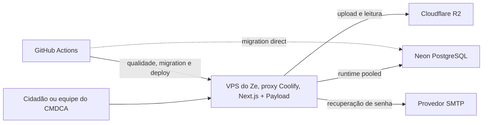

# Arquitetura

## Visão geral

```mermaid
flowchart LR
  C["Cidadão ou equipe do CMDCA"] --> V["VPS do Ze, proxy Coolify, Next.js + Payload"]
  V -->|"runtime pooled"| N["Neon PostgreSQL"]
  V -->|"upload e leitura"| R["Cloudflare R2"]
  V -->|"recuperação de senha"| E["Provedor SMTP"]
  G["GitHub Actions"] -->|"qualidade, migration e deploy"| V
  G -. "migration direct" .-> N
```

## Responsabilidade de cada serviço

| Serviço | Mantém | Não mantém |
| --- | --- | --- |
| GitHub Actions | qualidade, build, migração e deploy de produção | segredos exibidos em log, dados do CMS e uploads |
| VPS do Zé / Coolify | proxy HTTPS, container nonroot, logs e domínio | build, banco durável e arquivos enviados |
| Neon | conteúdo, usuários, versões e metadados do CMS | arquivos binários do R2 |
| Cloudflare R2 | imagens e PDFs | registros editoriais e permissões do CMS |
| SMTP | entrega de mensagens de recuperação | autenticação do painel |

## Conexões do Neon

`DATABASE_URI` é pooled e atende o container. `DATABASE_URI_UNPOOLED` é direta e existe para migrações. As migrações de produção são executadas exclusivamente pelo GitHub Actions. O ambiente local existente aponta para a base operacional e só deve ser usado em diagnóstico de leitura. Testes de escrita usam PostgreSQL efêmero e fixtures no CI, nunca a base principal.

O schema é controlado por arquivos de migração; `push` automático do ORM permanece desabilitado. Dados e schema precisam de backup antes de uma alteração de produção.

## Mídia

O Payload grava mídia com protocolo S3 no R2 e mantém metadados no Neon. Uma restauração completa pode exigir os dois serviços no mesmo ponto lógico. O host público configurado em `NEXT_PUBLIC_R2_PUBLIC_URL` precisa ser HTTPS e permitido pela configuração de imagens e segurança do site.

## Cache e atualização

Páginas públicas usam renderização incremental. Ao publicar ou despublicar, hooks revalidam as rotas afetadas. Editor, Jurídico e Administrador podem publicar ou despublicar; a revisão jurídica registrada é informativa. Separe documento no CMS, registro no Neon, objeto no R2 e resposta/cache do container/proxy ao diagnosticar. A topologia prevista é uma instância do CMDCA, sem cache compartilhado entre réplicas.

## Artefato e isolamento

GitHub Actions gera o standalone, testa o container e publica imagem com tag exclusiva por commit/execução e digest registrado. Coolify apenas executa a imagem. Não há compilação, seed nem migração na VPS. A aplicação CMDCA deve ter UUID, domínio, ambiente e credenciais próprios. Nenhum outro projeto da VPS integra esta arquitetura.

<!-- PENDENCIA: confirmar acesso, UUID, dominio, recursos, proxy e backups da aplicacao CMDCA na VPS real. -->

Não “limpe tudo” por reflexo em incidente. Primeiro identifique a camada, preserve logs e invalide somente o necessário.

## Fronteiras de segurança

- `/admin` e APIs administrativas dependem da autenticação e das regras de acesso do Payload;
- a API pública só deve retornar conteúdo publicado e campos explicitamente públicos;
- metadados internos de fonte, revisão e consentimento não são conteúdo público;
- R2 deve usar credencial limitada ao bucket necessário;
- a URL pública do R2 serve arquivos, mas não concede direito editorial de uso;
- URLs de preview/deployment não substituem a origem canônica e não devem entrar em sitemap.
